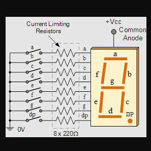
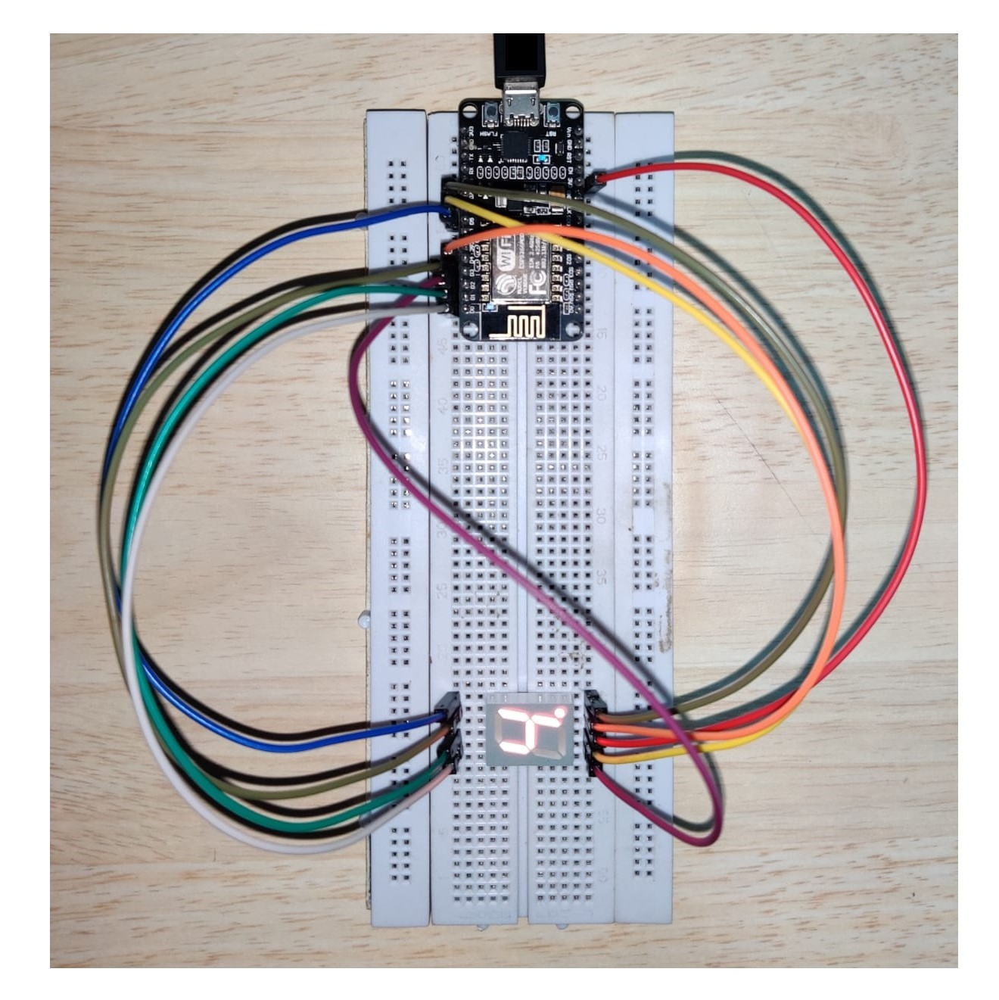

<!-- What was your motivation?
Why did you build this project?
What problem does it solve?
What did you learn?
What makes your project stand out?

Project's Title
Project Description
Table of Contents
How to Install and Run the Project
How to Use the Project
Include Credits
Add a License
Badges
How to Contribute to the Project
Include Tests -->

# NodeMCU 7-Segment WI-FI Controlled Display

> This is a project built to controll an LED7-Segment Display Display on WI-FI enabled devices, over an internal network using the ESP-8266 module inbuilt on the NodeMCU board.

## Table of Contents

- [Pre-requisites](#pre-requisites)
- [IDE-Configuration](#IDE-Configuration)
- [Setup](#Setup)
- [Code](#Code)
- [Usage](#usage)
<!-- - [API](#api)
- [Contribute](#contribute)
- [License](#license) -->

## Pre-requisites

- NodeMCU Module
- Common Anode 7-Segment Dispaly
- Micro USB Cable
- Bread Board
- 10 - Male to Male Jumper Cables
- System with Arduino IDE installed

## IDE-Configuration

Follow this [Procedure](https://www.instructables.com/Steps-to-Setup-Arduino-IDE-for-NODEMCU-ESP8266-WiF/) to configure the IDE according to the requirements.


- _SPIFFS plugin for IDE (Downloadable on the internet)_

- _Ensure that the `Flash Size` under the `Tools` menu is selected for atleast `512K SPIFFS` as this is where the webpage resides._

## SETUP

The circutry must be connected according to the images below.

### NodeMCU 1.0 PIN-OUT Diagram


### Common Anode 7-Segment LED Circut Configuration



> Note: We are using 7 Segment LED in common Anode configuration. Learn more about different kinds of 7 Segment Display combinations [here](https://www.engineersgarage.com/common-anode-and-cathode-7-segment-display/)

### Circut Connection



> Note: TX pin must not be used as a GPIO pin, as it will cause the text in Arduino Serial Monitor to be unreadable.

## Install

Install the IDE, boards and Plugins. Select the appropriate board (`Generic ESP8266 Module` for ESP 01) under the `Tools` menu. Ensure that the `Flash Size` under the `Tools` menu is selected for atleast `512K SPIFFS` as this is where the webpage resides.

## Usage

- Connect the board to the programmer and set it to flash mode (holding the flash pin or GPIO 0 to low while resetting the board) (Not required for the NodeMCU board)
- Compile and Upload the Code
- Select `Tools > ESP8266 Sketch Data Upload` to upload the data folder

### Important

The data folder must be a flat folder as the file system of ESP boards does not support folder structures

<!-- ## API

### Dimming

1. ### GET /dim

   Parameters
   value={dimming_value} (0 to 1023) : Sets the amount of dimming to apply to the light.

   ```sh
   GET /dim?value=200
   ```

2. ### GET /dimUp

   Increase the dimValue by stepSize (Default 100) and readjust the light.

3. ### GET /dimDown
   Decrease the dimValue by stepSize (Default 100) and readjust the light.

### Sleep Timer

The Sleep timer currently gets deactivated anytime the Dimming or Power On state of the light is changed

1. ### GET /time

   Parameters
   sec={#} : Set the number of seconds to countdown before lamp switches off
   min={#} : Set the number of minutes to countdown before lamp switches off
   hour={#} : Set the number of Hours to countdown before lamp switches off

   The sum of all three parameters in seconds is used to set the sleep timer. All three parameters are optional

   ```sh
   GET /time?sec=10&min=2&hour=0
   ```

### Lamp

1. ### GET /toggle
   Switches the lamp between Power ON and OFF state.

## Contribute

PRs accepted.

## License

[MIT © Ashwin P Chandran.](./LICENSE) -->
